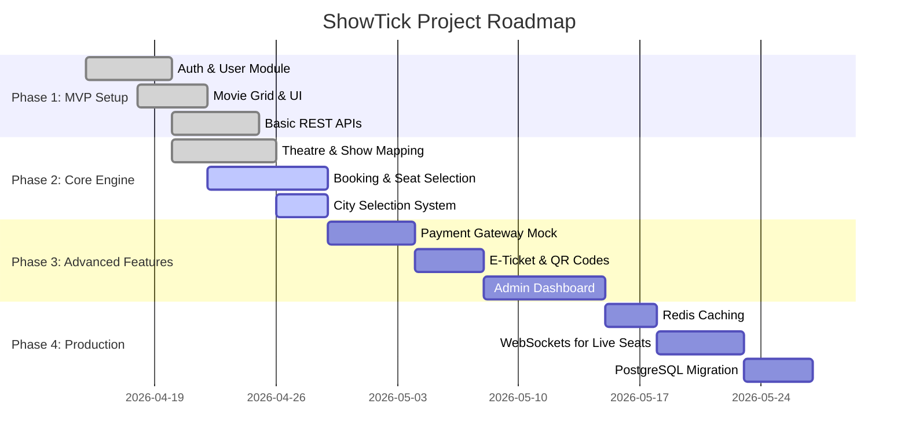
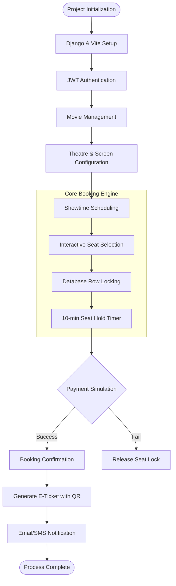
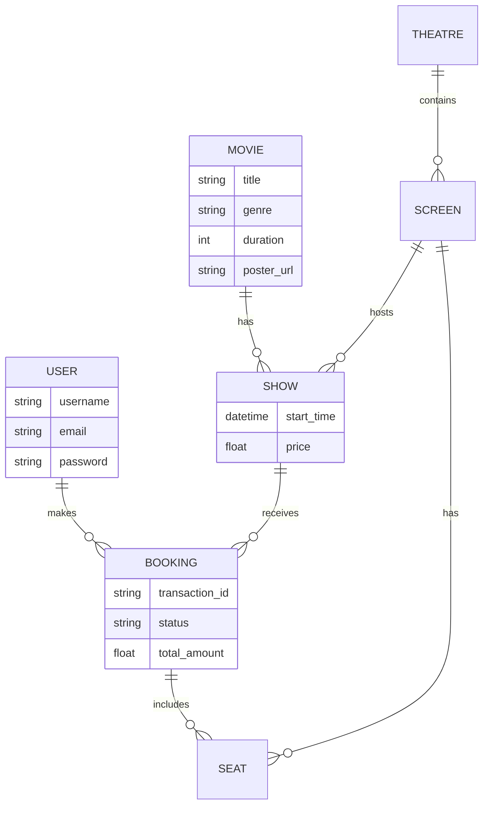
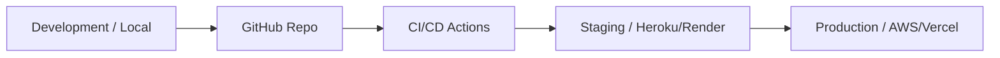

# ShowTick Detailed Project Plan

This document provides a detailed roadmap and functional breakdown of the ShowTick platform development.

## 📅 Development Roadmap (Gantt Chart)

## 🛠️ Feature Implementation Flow

## 📊 Database Relationship Diagram (ERD)

## 🚀 Deployment Strategy

