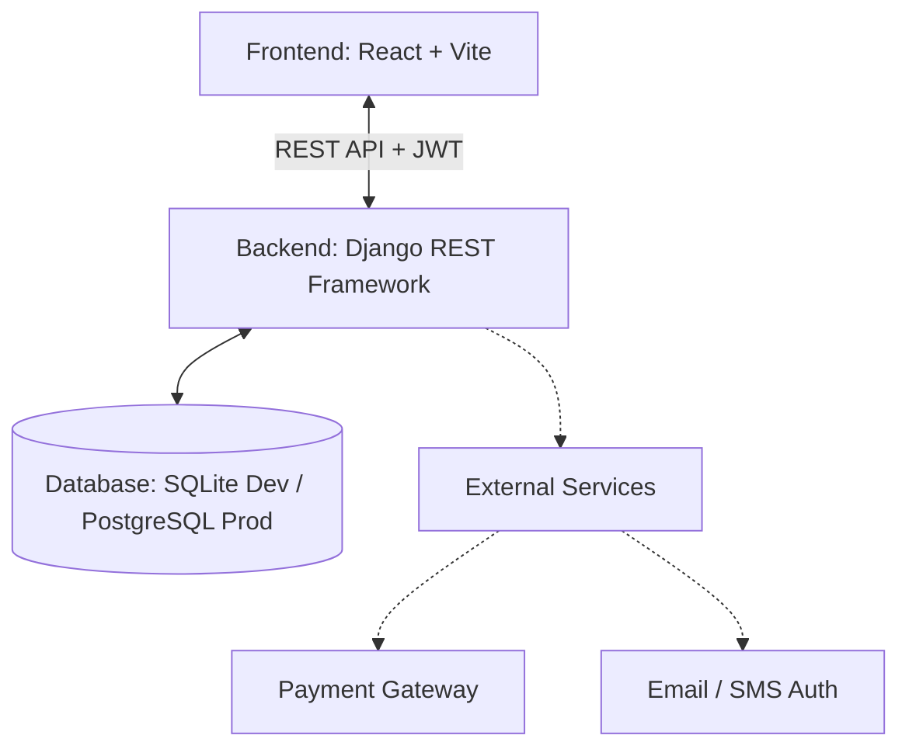

# ShowTick (BookMyShow Clone) Implementation Plan

## 1. High-Level Architecture

**Technology Stack:**
- **Frontend**: React, Vite, React Router DOM, Axios, Lucide-React, Pure CSS with Glassmorphism and modern UI patterns.
- **Backend**: Django, Django REST Framework, SimpleJWT for Authentication, Django CORS Headers.
- **Database**: Relational Database driven by Django ORM.

---

## 2. Core Modules & Implementation Status

### 👤 2.1 User Module (Implemented)
- **Status**: Implemented via simple JWT auth.
- **Features**: User registration, JWT login, LocalStorage token management, Profile dashboard.
- **Backend**: `users/` Django App.

### 🎬 2.2 Movie Module (Implemented)
- **Status**: Core MVP implemented.
- **Features**: Poster grid layout, Movie meta data, dynamic detail lookup.
- **Backend**: `movies/` Django App.

### 🏢 2.3 Theatre & Show Module (Implemented)
- **Status**: Integrated.
- **Features**: Grouping movies by geographical theatres, mapped daily schedules for movie screens.
- **Backend**: `theatres/` and `bookings/` Django Apps.

### 🎟️ 2.4 Booking & Seat Selection (Implemented)
- **Status**: Active Mock / MVP.
- **Features**: Interactive theater map layout, Available vs Selected vs Booked states, VIP seating tiers.
- **Backend**: `bookings/` Django App mapping users, seats, and shows heavily utilizing ManyToMany relationships.

### 💳 2.5 Checkout & Payment Module (Mocked)
- **Status**: Partially Implemented (Frontend mock).
- **Features**: Cost breakdown summary, convenience fee calculations, asynchronous loading states imitating gateway handshakes.

---

## 3. Database Schema

The core schema consists of interconnected models allowing robust querying:

* **User**: Connects with Bookings. Uses `AbstractUser` overriding email as username.
* **Movie**: Stores universal film data (Language, Duration, Posters).
* **Theatre**: Granular geographical locations (City, address).
* **Screen**: Child of Theatre, possesses unique `total_seats` caps.
* **Seat**: Maps exactly to a `Screen`, designating physical seat codes (`A1`, `B2`).
* **Show**: Resolves the many-to-many dilemma mapping `Movie`, `Screen`, and `start_time` together generating a localized run instances.
* **Booking**: Ultimate transaction model tying a `User`, a `Show`, and multiple `Seats`.

---

## 4. Frontend Application Structure

The single-page application relies strictly on modular breakdown:

* **`/pages/Home.jsx`**: Global landing. Lists all movies currently out.
* **`/pages/MovieDetails.jsx`**: Drilldown into specific movie synopses + theater showtimes.
* **`/pages/SeatSelection.jsx`**: Visual map engine rendering theater layouts.
* **`/pages/Checkout.jsx`**: Summary computation and simulated payment.
* **`/pages/Profile.jsx`**: Hybrid Login/Signup/Dashboard access.

---

## 5. Development Roadmap & Future Phases

### ✅ Phase 1: MVP Setup (Current)
- [x] Basic Auth capabilities.
- [x] Full UI construction with premium CSS.
- [x] Functional browsing architecture (`Home` -> `Movie` -> `Theatre` -> `Seat Selection`).
- [x] Foundational REST APIs operational.

### ✅ Phase 2: Booking Engine Hardening
- [x] Implement database-level row locking for concurrency.
- [x] Integrate global City Selection system.
- [x] Build automated expiry countdown timer for seat locks.

### ✅ Phase 3: Gateways & Notifications
- [x] Implement Sandbox Payment verification flow.
- [x] Digital E-Ticket generation with auto-QR codes and Print support.
- [x] Cross-City discovery engine.
- [x] Admin Insights Dashboard (Revenue & Booking analytics).

### 🔮 Phase 4: Production Polish
- [ ] Connect Real Redis server for caching.
- [ ] Implement WebSockets for live seat occupancy updates.
- [ ] Configure `Celery` worker queue to mail PDF QR code tickets on successful checkout.
- [ ] Migrate SQLite development DB to remote PostgreSQL instance.
- [ ] Build global site search filter (By languages, cities, genres).
